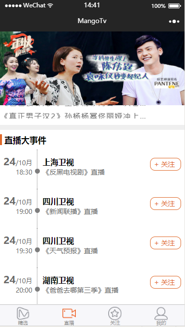
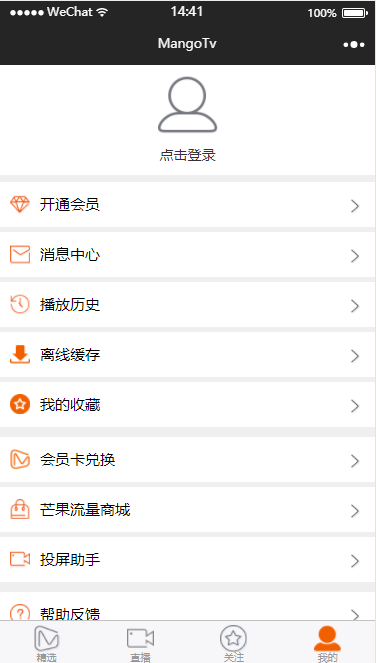
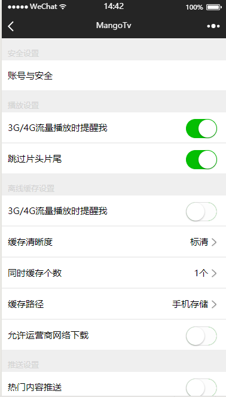
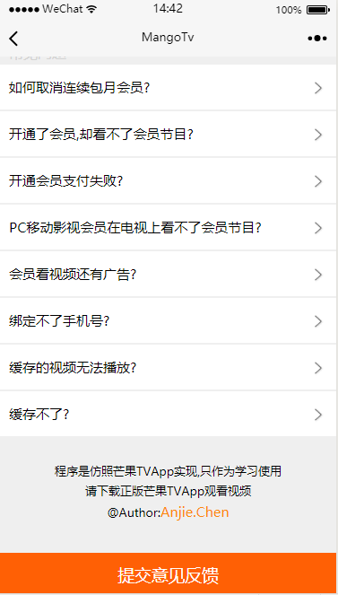

# weixinMinProgram
基于wafer2防芒果TVapp微信小程序实战

### 简介wafer2

后台的搭建涉及到购买服务器、购买数据库，然后要在服务器上安装运行环境等。对于新手来说并不知道怎么弄这些东西，这时候wafer2帮我做到了，让没有后台开发经验的程序员，也能搭建起自己的小程序后台

具体wafer2怎么使用，推荐一个文章[文档](http://www.jianshu.com/p/072ff89e723c),这篇博客对wafer2配合微信小程序进行了详细的介绍。

### 项目效果图
**首页：**<br/>

<br/>

**首页：**<br/>

<br/>

**直播：**<br/>

<br/>

**关注：**<br/>
<br/>

**我：**<br/>
<br/>

**设置：**<br/>
<br/>

**帮助：**<br/>
<br/>

### 使用项目

```
下载项目源码:
git clone https://github.com/anjiecc/weixinMinProgram.git

进入server文件
cd server 

安装依赖
npm install

进入client文件
cd client
npm install

打开微信开发工具导入项目,使用腾讯云上传代码,运行查看效果


```


****
**后台数据是在网上找的，地址搞忘记了**
